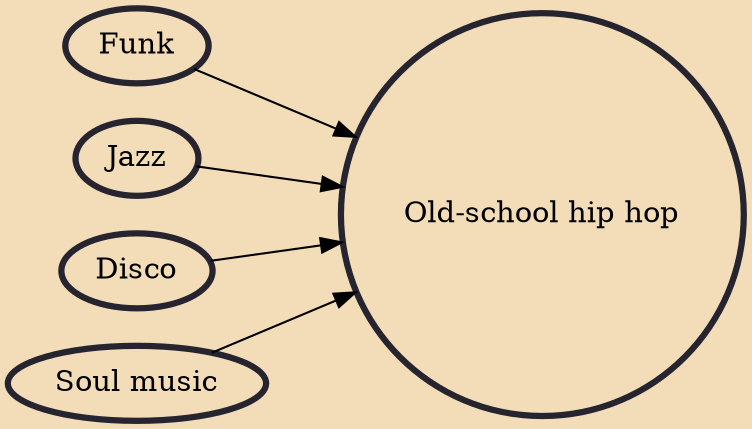

Old-school hip hop (also spelled old skool) is the earliest commercially recorded hip hop music and original style of the genre. It typically refers to the music created around 1979 to 1983, as well as any hip hop that does not adhere to contemporary styles.

## Influences
- [[Funk]]
- [[Jazz]]
- [[Disco]]
- [[Soul music]]
