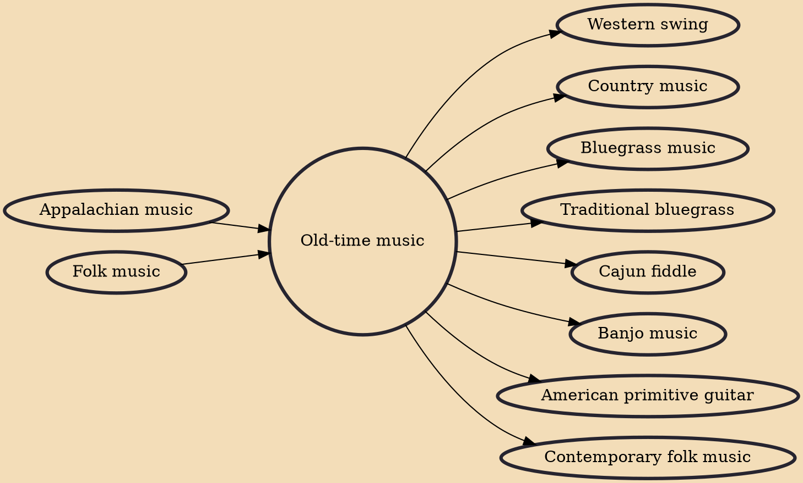

Old-time music is a genre of North American folk music. It developed along with various North American folk dances, such as square dancing, clogging, and buck dancing. It is played on acoustic instruments, generally centering on a combination of fiddle and plucked string instruments, most often the banjo, guitar, and mandolin. The genre is considered a precursor to modern country music.

## Influences
- [[Appalachian music]]
- [[Folk music]]

## Derivatives
- [[Western swing]]
- [[Country music]]
- [[Bluegrass music]]
- [[Traditional bluegrass]]
- [[Cajun fiddle]]
- [[Banjo music]]
- [[American primitive guitar]]
- [[Contemporary folk music]]
