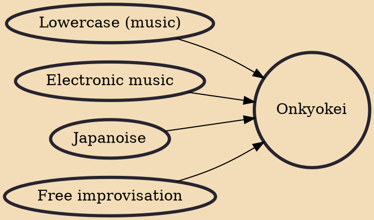

The Onkyo music movement or Onkyokei (音響系, Onkyōkei) (translation: "reverberation of sound") is a form of free improvisation, emerging from Japan in the late 1990s. Onkyō can be translated as "sound, noise, echo". Some artists commonly associated with Onkyō include Toshimaru Nakamura, Tetuzi Akiyama, Sachiko M, and Taku Sugimoto, among others. The Off Site, a venue in Tokyo, is home to the Onkyo music movement, which is characterized by improvisation, minimalism, and "quiet noise". Onkyo improvisation, "explores the fine-grained textural details of acoustic and electronic sound".

## Influences

- [[Lowercase (music)]]
- [[Electronic music]]
- [[Japanoise]]
- [[Free improvisation]]
