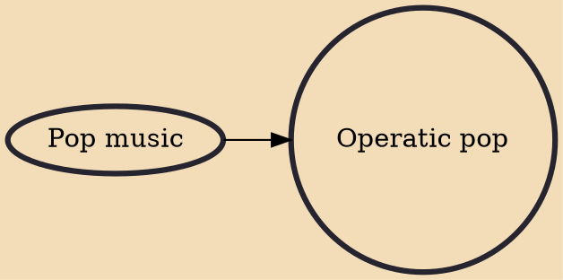

Operatic pop or popera is a subgenre of pop music that is performed in an operatic singing style or a song, theme or motif from classical music stylized as pop. The subgenre is often performed by classical crossover singers and acts, although that field is much broader in the types of music it encompasses. "Popera" performances, such as those by the Three Tenors, have reached larger audiences and brought in greater profits than typical for operatic music.

## Influences
- [[Pop music]]
