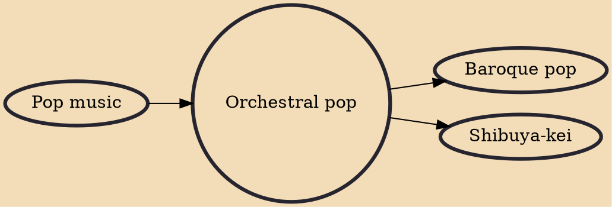

Orchestral pop (sometimes called ork-pop for short) is pop music that has been arranged and performed by a symphonic orchestra. It may also be conflated with the terms symphonic pop or chamber pop.

## Influences
- [[Pop music]]

## Derivatives
- [[Baroque pop]]
- [[Shibuya-kei]]
