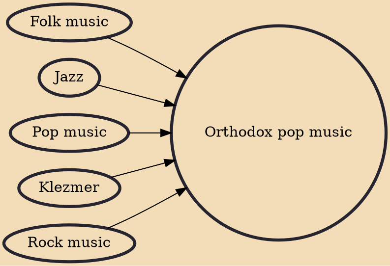

Orthodox pop, sometimes called Hasidic pop, Hasidic rock, K-pop (Kosher pop), Haredi pop, and Ortho-pop, is a form of contemporary Jewish religious music popular among Orthodox Jews. It typically draws stylistically from contemporary genres like pop, rock, jazz, and dance music, while incorporating text from Jewish prayer, Torah, and Talmud as well as traditional Jewish songs and occasional original English lyrics with themes of faith and positivity. The genre was pioneered in the 1970s by artists like Mordechai Ben David and the Miami Boys Choir, who incorporated secular pop and dance influences into their music in contrast to the more traditional Jewish music of the time, and has had continued success in the modern era with singers like Yaakov Shwekey, Lipa Schmeltzer, Baruch Levine, and

## Influences
- [[Folk music]]
- [[Jazz]]
- [[Pop music]]
- [[Klezmer]]
- [[Rock music]]
