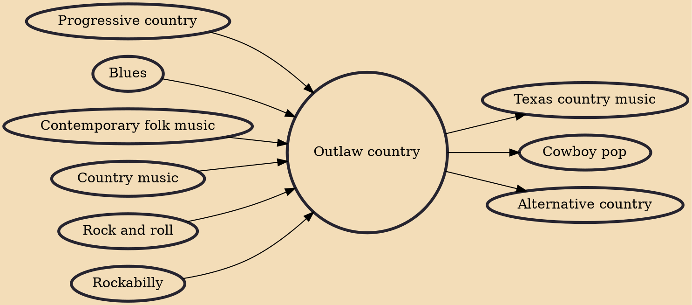

Outlaw country is a subgenre of American country music created by a small group of iconoclastic artists active in the 1970s and early 1980s, known collectively as the outlaw movement, who fought for and won their creative freedom outside of the Nashville establishment that dictated the sound of most country music of the era. Willie Nelson, Waylon Jennings, Kris Kristofferson, and David Allan Coe were among the movement's most commercially successful members.

## Influences
- [[Progressive country]]
- [[Blues]]
- [[Contemporary folk music]]
- [[Country music]]
- [[Rock and roll]]
- [[Rockabilly]]

## Derivatives
- [[Texas country music]]
- [[Cowboy pop]]
- [[Alternative country]]
