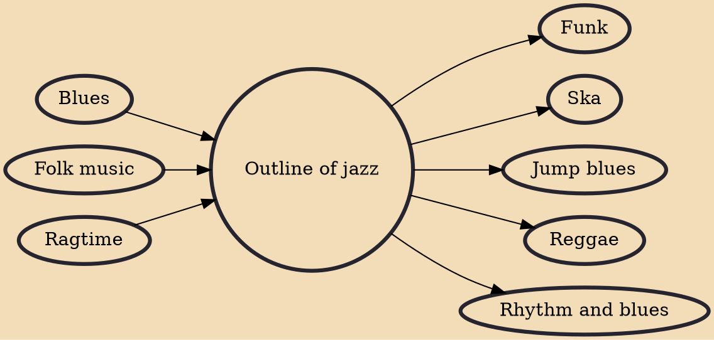

Jazz – musical style that originated at the beginning of the 20th century in African American communities in the Southern United States, mixing African music and European classical music traditions. Jazz is a music genre that originated from African American communities of New Orleans in the United States during the late 19th and early 20th centuries. It emerged in the form of independent traditional and popular musical styles, all linked by the common bonds of African American and European American musical parentage with a performance orientation.

## Influences
- [[Blues]]
- [[Folk music]]
- [[Ragtime]]

## Derivatives
- [[Funk]]
- [[Ska]]
- [[Jump blues]]
- [[Reggae]]
- [[Rhythm and blues]]
