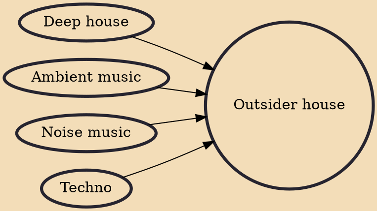

Outsider house (originally spawned as outsider dance, also known as raw house) is a genre of house music combining elements of deep house, techno, noise, and ambient, with artists embracing lo-fi techniques rather than the polished cleanliness of mainstream deep house and other EDM genres.

## Influences

- [[Deep house]]
- [[Ambient music]]
- [[Noise music]]
- [[Techno]]
