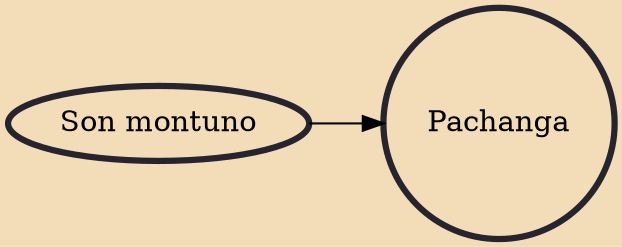

Pachanga is a genre of music which is described as a mixture of son montuno and merengue and has an accompanying signature style of dance. This type of music has a festive, lively style and is marked by jocular, mischievous lyrics. Pachanga originated in Cuba in the 1950s and played an important role in the evolution of Caribbean style music as it is today. Considered a prominent contributor to the eventual rise of salsa, Pachanga itself is an offshoot of Charanga style music. Very similar in sound to Cha-Cha but with a notably stronger down-beat, Pachanga once experienced massive popularity all across the Caribbean and was brought to the United States by Cuban immigrants post World War II. This led to an explosion of Pachanga music in Cuban music clubs that influenced Latin culture in the

## Influences

- [[Son montuno]]
