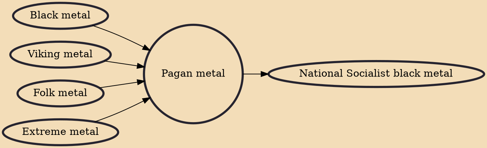

Pagan metal is a genre of heavy metal music which fuses extreme metal with "the pre-Christian traditions of a specific culture or region" through thematic concept, rustic melodies, unusual instruments or archaic languages, usually referring to folk metal or black metal. The Norwegian band In the Woods... was one of the first bands commonly viewed as pagan metal. Metal Hammer author Marc Halupczok wrote that Primordial's song "To Enter Pagan" from the band's demo "Dark Romanticism" contributed to defining the genre.

## Influences

- [[Black metal]]
- [[Viking metal]]
- [[Folk metal]]
- [[Extreme metal]]

## Derivatives

- [[National Socialist black metal]]
