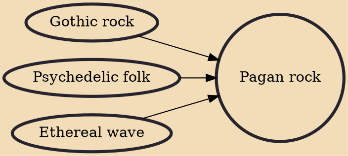

Pagan rock is a genre of rock music created by adherents of neopagan traditions. It emerged as a distinct genre from gothic rock in the 1980s. Bands in this genre will often use pagan and occult imagery and deal with pagan themes. In some cases the definition is stretched to include rock bands embraced by modern Pagans.

## Influences
- [[Gothic rock]]
- [[Psychedelic folk]]
- [[Ethereal wave]]
