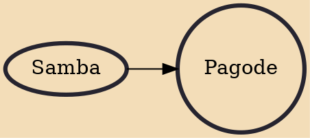

Pagode (Portuguese pronunciation: [paˈɡɔdʒ(i)]) is a Brazilian style of music that originated in Rio de Janeiro, Brazil, as a subgenre of Samba. Pagode originally meant a celebration with food, music, dance, and party. In 1978, singer Beth Carvalho was introduced to this music, liked it from the beginning, and recorded tracks by Zeca Pagodinho and others. Over time, pagode has been used by many commercial groups, which have included a version of the music filled with clichés, and there is now a sentiment that the term is a pejorative for "very commercial pop music" (see Pagode Romântico).

## Influences
- [[Samba]]
