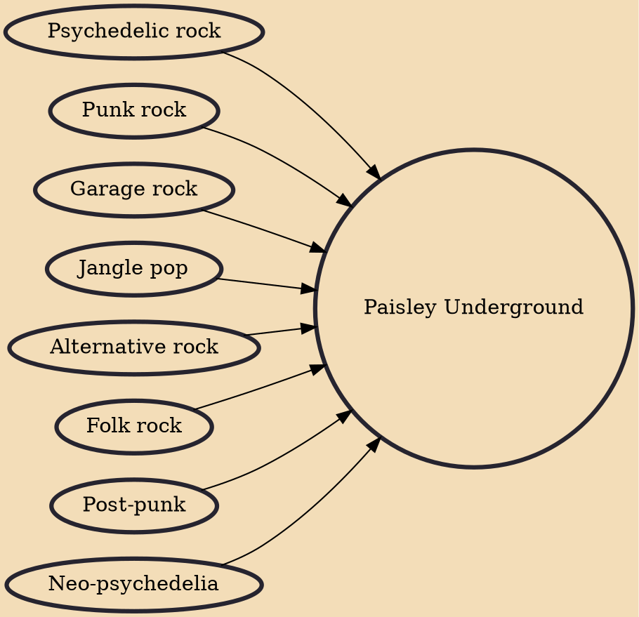

Paisley Underground is a musical genre that originated in California. It was particularly popular in Los Angeles, reaching a peak in the mid-1980s. Paisley Underground bands incorporated psychedelia, rich vocal harmonies and guitar interplay, owing a particular debt to 1960s groups such as Love and the Byrds, but more generally referencing a wide range of pop and garage rock revival.

## Influences
- [[Psychedelic rock]]
- [[Punk rock]]
- [[Garage rock]]
- [[Jangle pop]]
- [[Alternative rock]]
- [[Folk rock]]
- [[Post-punk]]
- [[Neo-psychedelia]]
