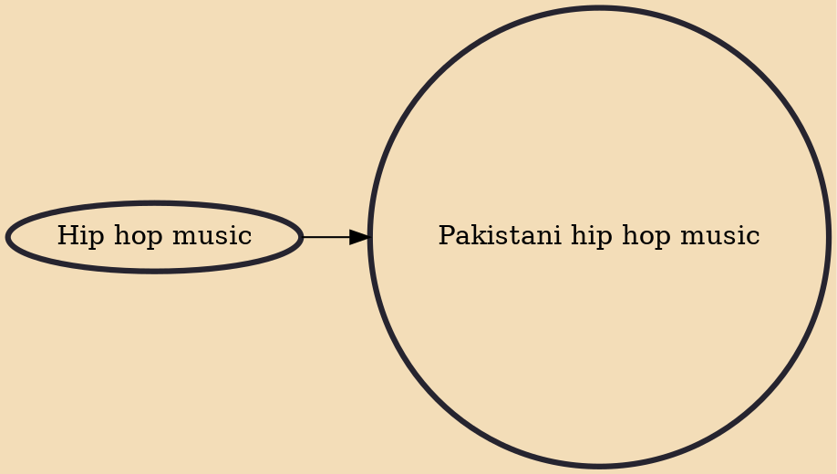

Pakistani hip hop is a music genre in Pakistan influenced heavily from merging American hip hop style beats with Pakistani poetry. The genre was initially dominated in English and Punjabi, but in recent years has expanded to Urdu, Sindhi, Pashto, and Balochi.

## Influences
- [[Hip hop music]]
