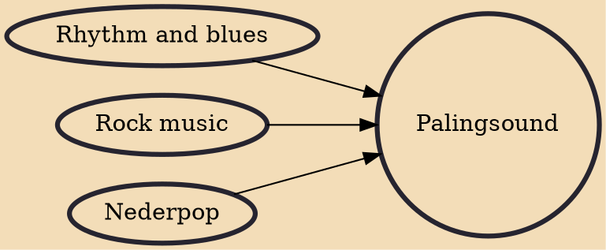

Palingsound (/pɑːlɪŋsaʊnt/; lit. 'European eel sound') is the unique musical sound attributed to a subgenre of Dutch pop music called palingpop. It is sometimes used to refer to the palingpop genre as a whole.

## Influences
- [[Rhythm and blues]]
- [[Rock music]]
- [[Nederpop]]
