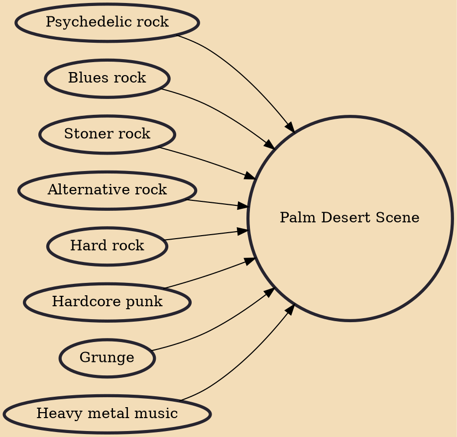

The Palm Desert Scene is a group of related bands and musicians from Palm Desert, California. Their hard rock sound – sometimes described as desert rock – contains elements of heavy metal, psychedelia, blues, punk, alternative, grunge, and other genres. It often features distinctive repetitive drum beats, a propensity for free-form jamming, and "trance-like" or "sludgy" grooves. The involved musicians often play in multiple bands simultaneously, and there is a high rate of collaboration between bands. The Palm Desert Scene is also notable for fostering stoner rock pioneers Kyuss. The term "stoner rock" is sometimes used interchangeably with the term "desert rock". However, not all Palm Desert scene bands are "stoner rock" and not all stoner rock bands sound exactly like those in Palm Deser

## Influences

- [[Psychedelic rock]]
- [[Blues rock]]
- [[Stoner rock]]
- [[Alternative rock]]
- [[Hard rock]]
- [[Hardcore punk]]
- [[Grunge]]
- [[Heavy metal music]]
