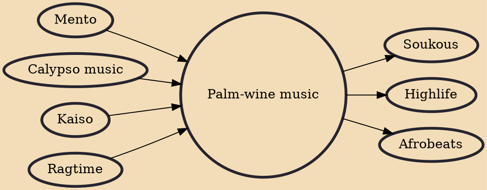

Palm-wine music (known as Maringa in Sierra Leone) is a West African musical genre. It evolved among the Kru people of Liberia and Sierra Leone, who used Portuguese guitars brought by sailors, combining local melodies and rhythms with Trinidadian calypso to create a "light, easy, lilting style". It would initially work its way inland where it would adopt a more traditional style than what was played in coastal areas. It would eventually gain popularity after Sierra Leone musician Ebenezer Calendar recorded songs in the 1950s and 1960s and continues to hold a small amount of that popularity.

## Influences
- [[Mento]]
- [[Calypso music]]
- [[Kaiso]]
- [[Ragtime]]

## Derivatives
- [[Soukous]]
- [[Highlife]]
- [[Afrobeats]]
