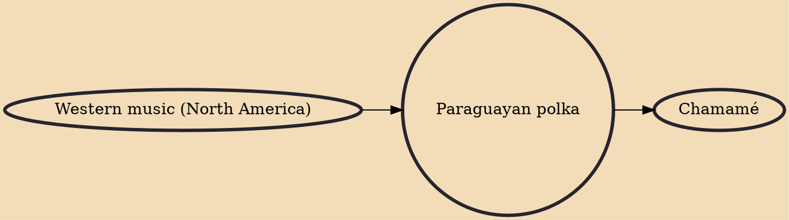

Paraguayan polka, also known as danza paraguaya (Paraguayan dance), is a style of music created in Paraguay in the 19th century.The Paraguayan polka is very different from the traditional polka, mainly because the Paraguayan version combines ternary and binary rhythms, whereas the European only uses binary. The juxtaposition of the mentioned rhythms gives the peculiar sound that characterizes this style. There are several variants of the Paraguayan polka such as polca syryry, polca kyre'y, polca correntina, polca popo, polca saraki, polca galopa, polca jekutu. All of them are slightly different because of the different influences and styles adopted by the composers in the early years of the Paraguayan polka.

## Influences
- [[Western music (North America)]]

## Derivatives
- [[Chamamé]]
