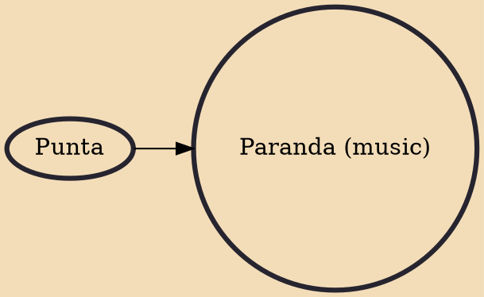

Paranda is both a Garifuna rhythm and music with Arawak and African elements which utilizes rhythmic ostinatos in duple meter. Similar to punta, the paranda is a slower rhythm than punta. Paranda mainly focuses on the struggles that occurs in the Garifuna community. and reflects Spanish influences. Traditionally, the guitar is played in paranda and not in punta. and its melodies are soulful lamentations.

## Influences

- [[Punta]]
