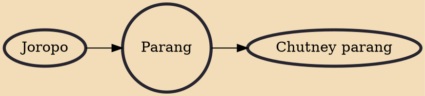

Parang is a popular folk music originating from Venezuela and Trinidad and Tobago that was brought to Trinidad and Tobago by Venezuelan migrants who were primarily of Amerindian, Spanish, Mestizo, Pardo, and African heritage, something which is strongly reflected in the music itself. The word is derived from two Spanish words: parranda, meaning "a spree”, and parar meaning "to stop". A new form of parang, soca parang, has emerged. Soca parang is a combination of soca and parang.

## Influences
- [[Joropo]]

## Derivatives
- [[Chutney parang]]
