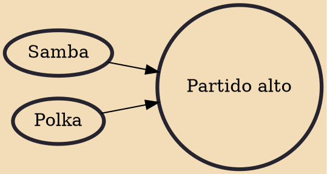

Partido Alto refers to a type of samba with a number of particularities. In the world of samba subgenres and in samba reunions, partido alto songs (informally called partidos) can represent a time for improvisation and (humorous or not) disputes, besides a stronger singalong opportunity for the participants. Partido Alto is also the name of a particular rhythm that is derived from the above-mentioned style of samba (especially in a jazz context). The rhythm is often played in samba, and is also the basis for the Partido Alto groove, in which more or all of the instruments accent this rhythm.

## Influences

- [[Samba]]
- [[Polka]]
