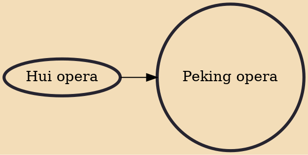

Peking opera, or Beijing opera (Chinese: 京劇; pinyin: Jīngjù), is the most dominant form of Chinese opera, which combines music, vocal performance, mime, dance and acrobatics. It arose in Beijing in the mid-Qing dynasty (1644–1912) and became fully developed and recognized by the mid-19th century. The form was extremely popular in the Qing court and has come to be regarded as one of the cultural treasures of China. Major performance troupes are based in Beijing, Tianjin and Shanghai. The art form is also preserved in Taiwan, where it is also known as Guójù (Chinese: 國劇; lit. 'National opera'). It has also spread to other regions such as the United States and Japan.

## Influences
- [[Hui opera]]
