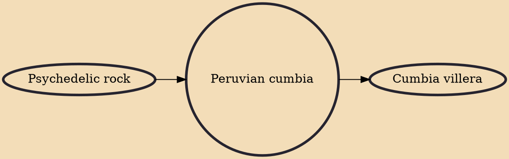

Peruvian cumbia is a subgenre of chicha (Andean tropical music) that became popular in the coastal cities of Peru, mainly in Lima in the 1960s through the fusion of local versions of the original Colombian genre, traditional highland huayno, and rock music, particularly surf rock and psychedelic rock. The term chicha is more frequently used for the pre-1990s variations of the subgenre.

## Influences
- [[Psychedelic rock]]

## Derivatives
- [[Cumbia villera]]
