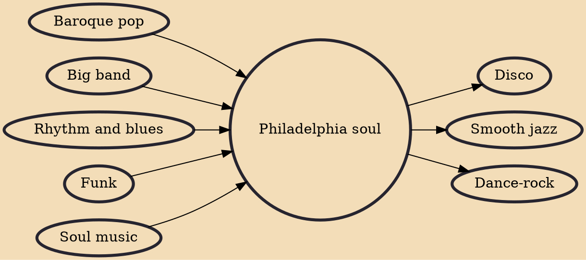

Philadelphia soul, sometimes called Philly soul, the Philadelphia sound, Phillysound, or TSOP (The Sound of Philadelphia), is a genre of late 1960s–1970s soul music characterized by funk influences and lush instrumental arrangements, often featuring sweeping strings and piercing horns. The genre laid the groundwork for disco by fusing the R&B rhythm sections of the 1960s with the pop vocal tradition, and featuring a slightly more pronounced jazz influence in its melodic structures and arrangements. Fred Wesley, the trombonist of the James Brown band and Parliament-Funkadelic, described the signature deep but orchestrated sound as "putting the bow tie on funk."

## Influences
- [[Baroque pop]]
- [[Big band]]
- [[Rhythm and blues]]
- [[Funk]]
- [[Soul music]]

## Derivatives
- [[Disco]]
- [[Smooth jazz]]
- [[Dance-rock]]
