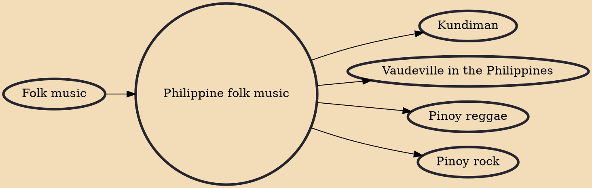

The traditional music of the Philippines reflects the Philippines' diverse culture, originating from more than 100 ethnolinguistic groups and shaped by a widely varying historical and sociocultural milieu. Like the folk music of other countries, it reflects the life of common, mostly rural Filipinos. Like their counterparts in Asia, many traditional songs from the Philippines have a strong connection with nature.

## Influences
- [[Folk music]]

## Derivatives
- [[Kundiman]]
- [[Vaudeville in the Philippines]]
- [[Pinoy reggae]]
- [[Pinoy rock]]
