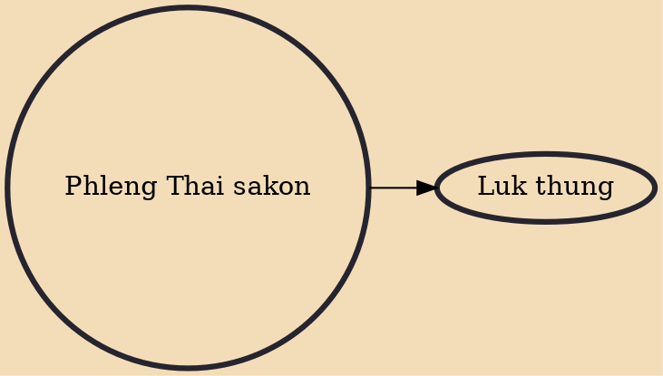

Phleng Thai sakon (Thai: เพลงไทยสากล) is a Thai term translating roughly as "international-style Thai music". It refers to Thai music in which traditional elements are blended with the use of Western notation and instruments. In the narrow sense, the term refers to the early movement in which this style of music was popularized. This roughly corresponds to the first half of the twentieth century, until the 1950s, when the style was split along cultural lines between the rural luk thung and the urban luk krung. In the wider sense, the term refers to all genres of Westernized Thai music (i.e. excluding folk and classical Thai), including luk thung, luk krung, phleng phuea chiwit and modern Thai pop (pop, luktung-pop, lukkwad-pop) and rock. As a genre, the most representative composer of phle

## Derivatives

- [[Luk thung]]
