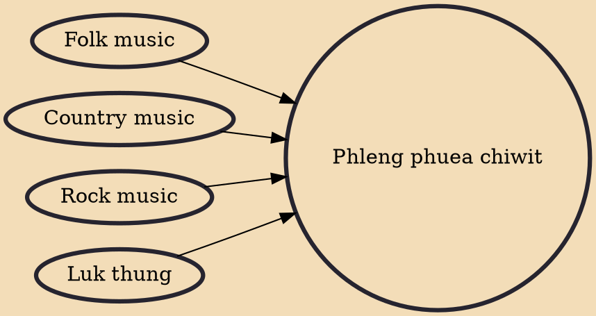

Phleng phuea chiwit (Thai: เพลงเพื่อชีวิต; IPA:[pʰlēːŋ pʰɯ̂a tɕʰīː.wít]; lit. "songs for life") describes a type of Thai folk music, strongly influenced by elements of Western folk and rock music with a protest theme mainly centred on the hardship of working-class people and in favor of a democratic political system. The term phleng phuea chiwit (songs for life) came from "art for life" or "literature for life", that is, literature on life and society, while phleng phuea chiwit era flourishing in the 1970s also known as "jewel of the literature of life".

## Influences
- [[Folk music]]
- [[Country music]]
- [[Rock music]]
- [[Luk thung]]
