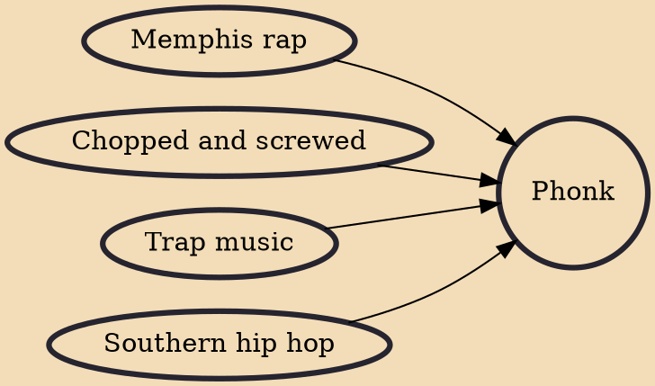

Phonk (/fɒŋk/ ) is a subgenre of hip hop and trap music directly inspired by 1990s Memphis rap. Mostly present on the SoundCloud platform, the music is characterized by vocals from old Memphis rap tapes and samples from early-1990s hip hop, often combining them with elements of jazz and funk. The genre deploys distorting techniques such as chopped and screwed to create a darker sound.

## Influences
- [[Memphis rap]]
- [[Chopped and screwed]]
- [[Trap music]]
- [[Southern hip hop]]
