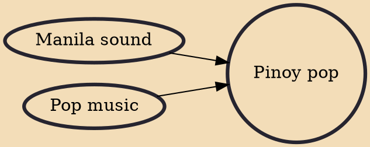

Pinoy pop or P-pop (also known as Philippine pop or Pilipino pop) refers to a contemporary pop music in the Philippines originating from the OPM genre. With its beginnings in the late 1970s, Pinoy pop is a growing genre in year of the 2020s. Through the 1990s to the 2000s, Pinoy pop was regularly showcased in the live band scene. Groups such as Neocolours, Side A, Introvoys, the Teeth, Yano, True Faith, Passage and Freestyle popularized songs that clearly reflect the sentimental character of OPM pop of this era.

## Influences
- [[Manila sound]]
- [[Pop music]]
