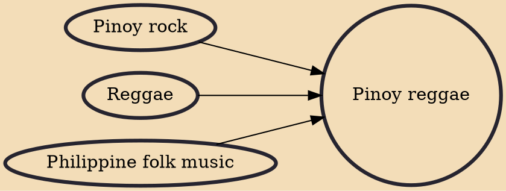

Filipino reggae or Pinoy reggae is reggae music created in the Philippines. The country has several bands and sound systems that play reggae and dancehall music in a style faithful to its expression in Jamaica. Reggae in the Philippines comprises the many forms of reggae and its subgenres, and at times combining traditional Filipino forms of music and instruments in their music.

## Influences

- [[Pinoy rock]]
- [[Reggae]]
- [[Philippine folk music]]
