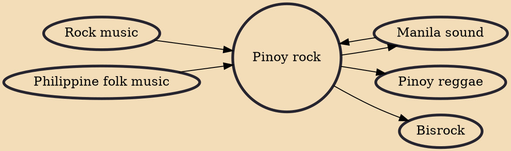

Pinoy rock, or Filipino rock, is the brand of rock music produced in the Philippines or by Filipinos. It has become as diverse as the rock music genre itself, and bands adopting this style are now further classified under more specific genres or combinations of genres like alternative rock, post-grunge, ethnic, new wave, pop rock, punk rock, funk, reggae, heavy metal, ska, and recently, indie. Because these genres are generally considered to fall under the broad rock music category, Pinoy rock may be more specifically defined as rock music with Filipino cultural sensibilities.

## Influences

- [[Manila sound]]
- [[Rock music]]
- [[Philippine folk music]]

## Derivatives

- [[Pinoy reggae]]
- [[Manila sound]]
- [[Bisrock]]
