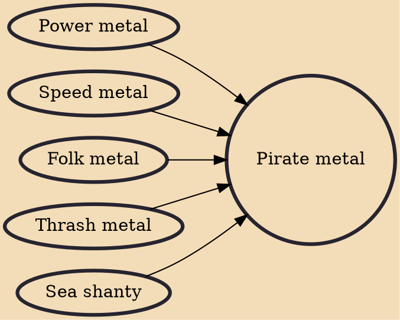

Pirate metal is a style of heavy metal music characterized by its incorporation of pirate mythology within the music and sometimes in stage performances. Lyrics often use piratical jargon and various musical genres, such as thrash metal, speed metal, and folk metal, may be combined with traditional-sounding songs like sea shanties. Folk instruments, such as the concertina, can be incorporated or emulated with synthesizers. Band members often dress up in period costume during performances, and concert attendees may do so as well. Pirate metal is sometimes referred to by the media as a music scene.

## Influences
- [[Power metal]]
- [[Speed metal]]
- [[Folk metal]]
- [[Thrash metal]]
- [[Sea shanty]]
