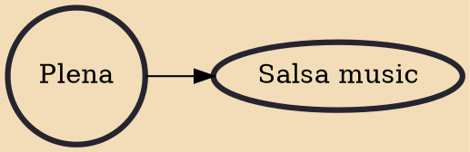

```dot
digraph {
	graph [bgcolor="#F3DDB8" rankdir=LR]
	node [color="#26242F" penwidth=3.0]
	Plena [shape=circle]
	"Salsa music" [URL="/salsa-music/"]
	Plena -> "Salsa music"
}
```

Plena is a genre of music and dance native to Puerto Rico.

## Derivatives

- [[Salsa music]]
