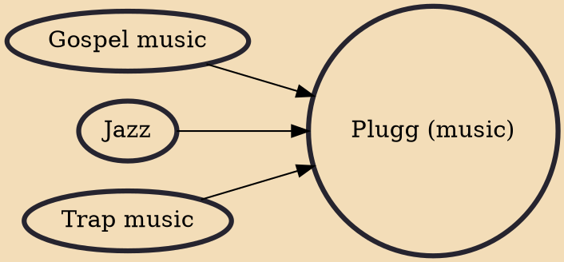

Plugg (also spelled plug) is a subgenre of trap music, that stems from the production style of Zaytoven, later polished and expanded by beatmakers from Beatpluggz collective, mainly by MexikoDro, StoopidXool, PoloBoyShawty and Ka$h3x in the mid-2010s via online distribution on platform SoundCloud. Vocally, plugg ranges from instrumental beats without vocals, to songs with either rapping or mellow singing. Rapping flows, used in plugg, range from aggressive to relaxed and mellow.

## Influences
- [[Gospel music]]
- [[Jazz]]
- [[Trap music]]
