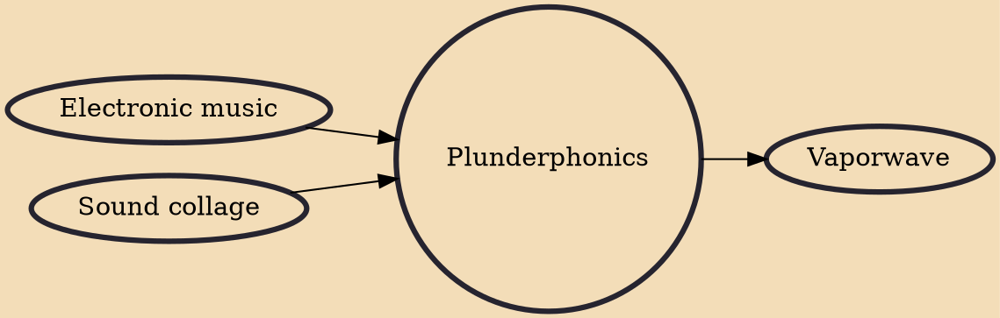

Plunderphonics is a music genre in which tracks are constructed by sampling recognizable musical works. The term was coined by composer John Oswald in 1985 in his essay "Plunderphonics, or Audio Piracy as a Compositional Prerogative", and eventually explicitly defined in the liner notes of his Grayfolded album. Plunderphonics can be considered a form of sound collage. Oswald has described it as a referential and self-conscious practice which interrogates notions of originality and identity.

## Influences
- [[Electronic music]]
- [[Sound collage]]

## Derivatives
- [[Vaporwave]]
