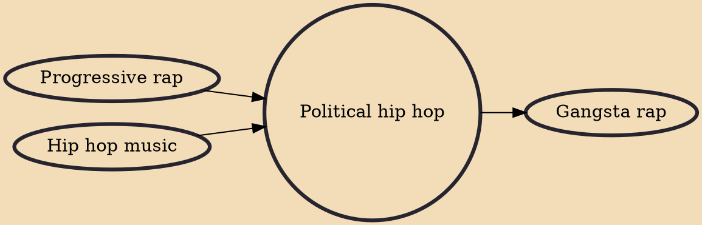

Political hip hop is a subgenre of hip hop music that was developed in the 1980s as a way of turning hip hop into a call for political and/or social action and a form of social and/or political activism. Inspired by 1970s political artists such as The Last Poets and musician Gil Scott-Heron, Public Enemy was the first predominantly political hip-hop group. The genre has helped to create a new form of social expression for subordinate groups to speak about their exclusions, injustices and lack of power. Political hip-hop is the use of hip hop music to send political messages to inspire action or social change or to convince the listener of a particular worldview. There is no all-encompassing political hip-hop ideology; rather, there are multiple perspectives that range anywhere from anarchi

## Influences
- [[Progressive rap]]
- [[Hip hop music]]

## Derivatives
- [[Gangsta rap]]
