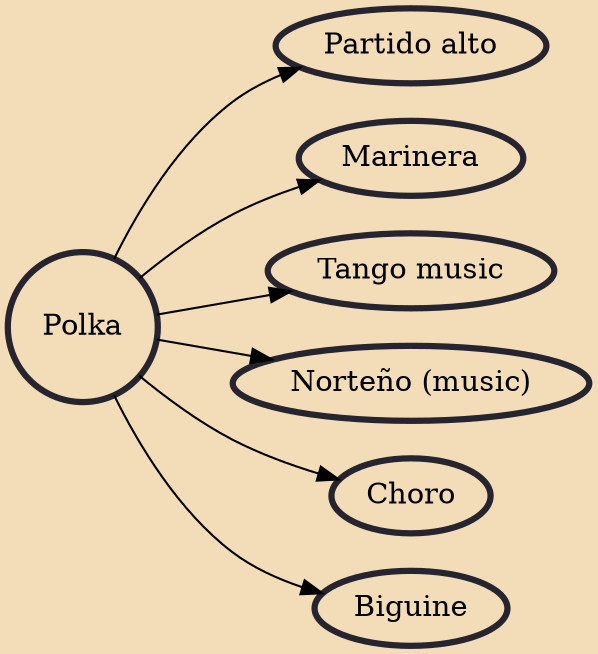

Polka is a dance and genre of dance music originating in nineteenth-century Bohemia, now part of the Czech Republic. Though associated with Czech culture, polka is popular throughout Europe and the Americas.

## Derivatives
- [[Partido alto]]
- [[Marinera]]
- [[Tango music]]
- [[Norteño (music)]]
- [[Choro]]
- [[Biguine]]
