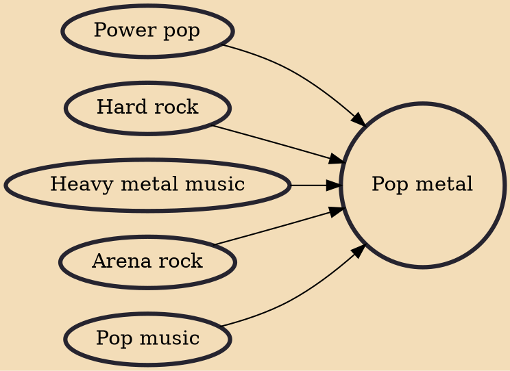

Pop metal (sometimes conflated with or used interchangeably with glam metal) is an umbrella term for commercial heavy metal and hard rock styles which feature prominent pop music elements such as catchy hooks and anthemic choruses. It became popular in the 1980s among acts such as Bon Jovi, Europe, Def Leppard, Mötley Crüe, and Ratt. The term is also applied some bands and artists that have formed since the 1990s that mix aspects of pop and heavy metal into their sound.

## Influences

- [[Power pop]]
- [[Hard rock]]
- [[Heavy metal music]]
- [[Arena rock]]
- [[Pop music]]
