```dot
digraph {
	graph [bgcolor="#F3DDB8" rankdir=LR]
	node [color="#26242F" penwidth=3.0]
	"Pop music" [shape=circle]
	"Contemporary folk music" [URL="/contemporary-folk-music/"]
	"Contemporary folk music" -> "Pop music"
	"Rock and roll" [URL="/rock-and-roll/"]
	"Rock and roll" -> "Pop music"
	"Traditional pop" [URL="/traditional-pop/"]
	"Traditional pop" -> "Pop music"
	"Psychedelic pop" [URL="/psychedelic-pop/"]
	"Pop music" -> "Psychedelic pop"
	"Baroque pop" [URL="/baroque-pop/"]
	"Pop music" -> "Baroque pop"
	"Vocal trance" [URL="/vocal-trance/"]
	"Pop music" -> "Vocal trance"
	Stronda [URL="/stronda/"]
	"Pop music" -> Stronda
	"Tecno brega" [URL="/tecno-brega/"]
	"Pop music" -> "Tecno brega"
	Chalga [URL="/chalga/"]
	"Pop music" -> Chalga
	Nederpop [URL="/nederpop/"]
	"Pop music" -> Nederpop
	"Emo pop" [URL="/emo-pop/"]
	"Pop music" -> "Emo pop"
	"Schlager music" [URL="/schlager-music/"]
	"Pop music" -> "Schlager music"
	"J-pop" [URL="/j-pop/"]
	"Pop music" -> "J-pop"
	"Neue Volksmusik" [URL="/neue-volksmusik/"]
	"Pop music" -> "Neue Volksmusik"
	"Country pop" [URL="/country-pop/"]
	"Pop music" -> "Country pop"
	"Dance-pop" [URL="/dance-pop/"]
	"Pop music" -> "Dance-pop"
	"Pop-punk" [URL="/pop-punk/"]
	"Pop music" -> "Pop-punk"
	"Pop rap" [URL="/pop-rap/"]
	"Pop music" -> "Pop rap"
	"Pop metal" [URL="/pop-metal/"]
	"Pop music" -> "Pop metal"
	"Brill Building (genre)" [URL="/brill-building-genre/"]
	"Pop music" -> "Brill Building (genre)"
	"Indie pop" [URL="/indie-pop/"]
	"Pop music" -> "Indie pop"
	Mandopop [URL="/mandopop/"]
	"Pop music" -> Mandopop
	"Thai pop music" [URL="/thai-pop-music/"]
	"Pop music" -> "Thai pop music"
	Bardcore [URL="/bardcore/"]
	"Pop music" -> Bardcore
	Eurodisco [URL="/eurodisco/"]
	"Pop music" -> Eurodisco
	"Future soul" [URL="/future-soul/"]
	"Pop music" -> "Future soul"
	"Progressive pop" [URL="/progressive-pop/"]
	"Pop music" -> "Progressive pop"
	Jaiva [URL="/jaiva/"]
	"Pop music" -> Jaiva
	"Grebo (music)" [URL="/grebo-music/"]
	"Pop music" -> "Grebo (music)"
	"Orchestral pop" [URL="/orchestral-pop/"]
	"Pop music" -> "Orchestral pop"
	"Space age pop" [URL="/space-age-pop/"]
	"Pop music" -> "Space age pop"
	"Al Jeel" [URL="/al-jeel/"]
	"Pop music" -> "Al Jeel"
	"Tejano music" [URL="/tejano-music/"]
	"Pop music" -> "Tejano music"
	RnBass [URL="/rnbass/"]
	"Pop music" -> RnBass
	Crunkcore [URL="/crunkcore/"]
	"Pop music" -> Crunkcore
	Worldbeat [URL="/worldbeat/"]
	"Pop music" -> Worldbeat
	"Mumble rap" [URL="/mumble-rap/"]
	"Pop music" -> "Mumble rap"
	"Pinoy pop" [URL="/pinoy-pop/"]
	"Pop music" -> "Pinoy pop"
	"Quiet storm" [URL="/quiet-storm/"]
	"Pop music" -> "Quiet storm"
	"Turbo-folk" [URL="/turbo-folk/"]
	"Pop music" -> "Turbo-folk"
	Dansband [URL="/dansband/"]
	"Pop music" -> Dansband
	"Mashup (music)" [URL="/mashup-music/"]
	"Pop music" -> "Mashup (music)"
	"New jack swing" [URL="/new-jack-swing/"]
	"Pop music" -> "New jack swing"
	Austropop [URL="/austropop/"]
	"Pop music" -> Austropop
	"New Pop" [URL="/new-pop/"]
	"Pop music" -> "New Pop"
	"Zhongguo feng (music)" [URL="/zhongguo-feng-music/"]
	"Pop music" -> "Zhongguo feng (music)"
	"Twee pop" [URL="/twee-pop/"]
	"Pop music" -> "Twee pop"
	"New Orleans Soul" [URL="/new-orleans-soul/"]
	"Pop music" -> "New Orleans Soul"
	"Operatic pop" [URL="/operatic-pop/"]
	"Pop music" -> "Operatic pop"
	Europop [URL="/europop/"]
	"Pop music" -> Europop
	"Smooth soul" [URL="/smooth-soul/"]
	"Pop music" -> "Smooth soul"
	"Sophisti-pop" [URL="/sophisti-pop/"]
	"Pop music" -> "Sophisti-pop"
	Disco [URL="/disco/"]
	"Pop music" -> Disco
	"Smooth jazz" [URL="/smooth-jazz/"]
	"Pop music" -> "Smooth jazz"
	"Bhangra (music)" [URL="/bhangra-music/"]
	"Pop music" -> "Bhangra (music)"
	Tallava [URL="/tallava/"]
	"Pop music" -> Tallava
	"Folk-pop" [URL="/folk-pop/"]
	"Pop music" -> "Folk-pop"
	"Cringe pop" [URL="/cringe-pop/"]
	"Pop music" -> "Cringe pop"
	"Mexican pop music" [URL="/mexican-pop-music/"]
	"Pop music" -> "Mexican pop music"
	Tropipop [URL="/tropipop/"]
	"Pop music" -> Tropipop
	"Visual kei" [URL="/visual-kei/"]
	"Pop music" -> "Visual kei"
	"Contemporary R&B" [URL="/contemporary-rb/"]
	"Pop music" -> "Contemporary R&B"
	"Latin pop" [URL="/latin-pop/"]
	"Pop music" -> "Latin pop"
	"Teen pop" [URL="/teen-pop/"]
	"Pop music" -> "Teen pop"
	Grindie [URL="/grindie/"]
	"Pop music" -> Grindie
	"Folk rock" [URL="/folk-rock/"]
	"Pop music" -> "Folk rock"
	"Dancehall pop" [URL="/dancehall-pop/"]
	"Pop music" -> "Dancehall pop"
	"Reggae fusion" [URL="/reggae-fusion/"]
	"Pop music" -> "Reggae fusion"
	"City pop" [URL="/city-pop/"]
	"Pop music" -> "City pop"
	"Cowboy pop" [URL="/cowboy-pop/"]
	"Pop music" -> "Cowboy pop"
	"Alternative hip hop" [URL="/alternative-hip-hop/"]
	"Pop music" -> "Alternative hip hop"
	"Experimental pop" [URL="/experimental-pop/"]
	"Pop music" -> "Experimental pop"
	Skiladiko [URL="/skiladiko/"]
	"Pop music" -> Skiladiko
	"New flamenco" [URL="/new-flamenco/"]
	"Pop music" -> "New flamenco"
	"Electronic rock" [URL="/electronic-rock/"]
	"Pop music" -> "Electronic rock"
	"Shibuya-kei" [URL="/shibuya-kei/"]
	"Pop music" -> "Shibuya-kei"
	"Bro-country" [URL="/bro-country/"]
	"Pop music" -> "Bro-country"
	"Lao pop" [URL="/lao-pop/"]
	"Pop music" -> "Lao pop"
	"K-pop" [URL="/k-pop/"]
	"Pop music" -> "K-pop"
	"Motown (music style)" [URL="/motown-music-style/"]
	"Pop music" -> "Motown (music style)"
	"V-pop" [URL="/v-pop/"]
	"Pop music" -> "V-pop"
	"Trance music" [URL="/trance-music/"]
	"Pop music" -> "Trance music"
	"Orthodox pop music" [URL="/orthodox-pop-music/"]
	"Pop music" -> "Orthodox pop music"
	"Bubblegum music" [URL="/bubblegum-music/"]
	"Pop music" -> "Bubblegum music"
}
```

Pop music is a genre of popular music that originated in its modern form during the mid-1950s in the United States and the United Kingdom. The terms popular music and pop music are often used interchangeably, although the former describes all music that is popular and includes many disparate styles. During the 1950s and 1960s, pop music encompassed rock and roll and the youth-oriented styles it influenced. Rock and pop music remained roughly synonymous until the late 1960s, after which pop became associated with music that was more commercial, ephemeral, and accessible.

## Influences
- [[Contemporary folk music]]
- [[Rock and roll]]
- [[Traditional pop]]

## Derivatives
- [[Psychedelic pop]]
- [[Baroque pop]]
- [[Vocal trance]]
- [[Stronda]]
- [[Tecno brega]]
- [[Chalga]]
- [[Nederpop]]
- [[Emo pop]]
- [[Schlager music]]
- [[J-pop]]
- [[Neue Volksmusik]]
- [[Country pop]]
- [[Dance-pop]]
- [[Pop-punk]]
- [[Pop rap]]
- [[Pop metal]]
- [[Brill Building (genre)]]
- [[Indie pop]]
- [[Mandopop]]
- [[Thai pop music]]
- [[Bardcore]]
- [[Eurodisco]]
- [[Future soul]]
- [[Progressive pop]]
- [[Jaiva]]
- [[Grebo (music)]]
- [[Orchestral pop]]
- [[Space age pop]]
- [[Al Jeel]]
- [[Tejano music]]
- [[RnBass]]
- [[Crunkcore]]
- [[Worldbeat]]
- [[Mumble rap]]
- [[Pinoy pop]]
- [[Quiet storm]]
- [[Turbo-folk]]
- [[Dansband]]
- [[Mashup (music)]]
- [[New jack swing]]
- [[Austropop]]
- [[New Pop]]
- [[Zhongguo feng (music)]]
- [[Twee pop]]
- [[New Orleans Soul]]
- [[Operatic pop]]
- [[Europop]]
- [[Smooth soul]]
- [[Sophisti-pop]]
- [[Disco]]
- [[Smooth jazz]]
- [[Bhangra (music)]]
- [[Tallava]]
- [[Folk-pop]]
- [[Cringe pop]]
- [[Mexican pop music]]
- [[Tropipop]]
- [[Visual kei]]
- [[Contemporary R&B]]
- [[Latin pop]]
- [[Teen pop]]
- [[Grindie]]
- [[Folk rock]]
- [[Dancehall pop]]
- [[Reggae fusion]]
- [[City pop]]
- [[Cowboy pop]]
- [[Alternative hip hop]]
- [[Experimental pop]]
- [[Skiladiko]]
- [[New flamenco]]
- [[Electronic rock]]
- [[Shibuya-kei]]
- [[Bro-country]]
- [[Lao pop]]
- [[K-pop]]
- [[Motown (music style)]]
- [[V-pop]]
- [[Trance music]]
- [[Orthodox pop music]]
- [[Bubblegum music]]
