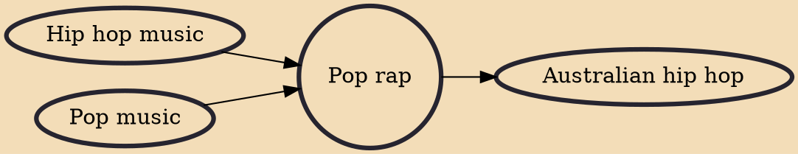

Pop rap (also known as pop hip-hop, hip pop, melodic hip-hop or melodic rap) is a genre of music fusing the rhythm-based lyricism of hip hop music with pop music's preference for melodious vocals and catchy tunes. This genre gained mainstream popularity during the 1990s, though the influences and roots of pop rap can trace back to late-1980s hip hop artists such as Run-DMC, LL Cool J, and Beastie Boys. The lyrics are often lighthearted, with choruses similar to those heard in pop music.

## Influences
- [[Hip hop music]]
- [[Pop music]]

## Derivatives
- [[Australian hip hop]]
