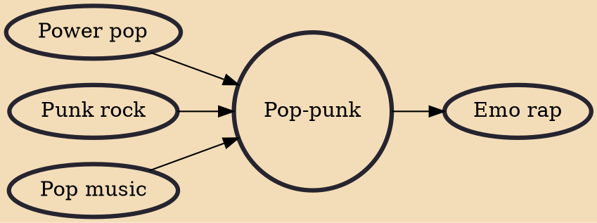

Pop-punk (or punk-pop) is a rock music genre that combines elements of punk rock with power pop or pop. It is defined for its emphasis on classic pop songcraft, as well as adolescent and anti-suburbia themes, and is distinguished from other punk-variant genres by drawing more heavily from 1960s bands such as the Beatles, the Kinks, and the Beach Boys. The genre has evolved throughout its history, absorbing elements from new wave, college rock, ska, rap, emo, and boy bands. It is sometimes considered interchangeable with power pop and skate punk.

## Influences

- [[Power pop]]
- [[Punk rock]]
- [[Pop music]]

## Derivatives

- [[Emo rap]]
