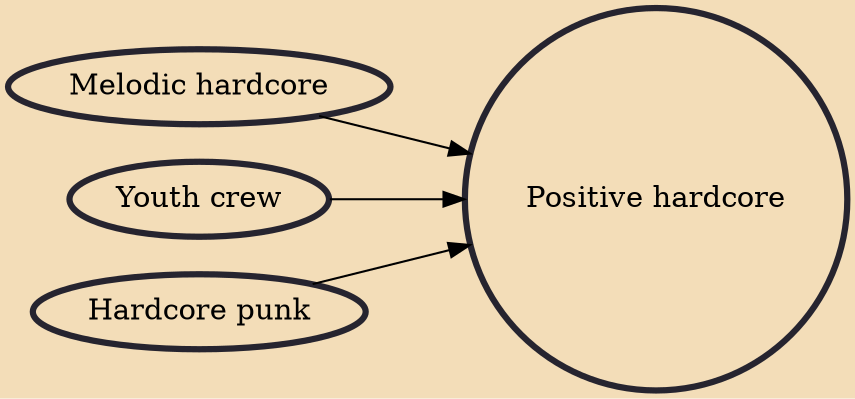

Positive hardcore (sometimes shortened to posicore or posi-core) is a branch of the hardcore punk music scene, that is socially aware, or focuses on values, such as being inclusive, community-oriented, and anti-violent. The genre was created as a backlash to the violence and negativity in the straight edge scene.

## Influences
- [[Melodic hardcore]]
- [[Youth crew]]
- [[Hardcore punk]]
