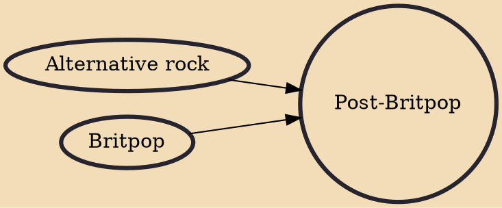

Post-Britpop is an alternative rock subgenre and is the period in the late 1990s and early 2000s, following Britpop, when the media were identifying a "new generation" or "second wave" of guitar bands influenced by acts like Oasis and Blur, but with less overt British concerns in their lyrics and making more use of American rock and indie influences, as well as experimental music. Bands in the post-Britpop era that had been established acts, but gained greater prominence after the decline of Britpop, such as Radiohead and the Verve, and new acts such as Travis, Keane, Snow Patrol, Stereophonics, Feeder, Toploader and particularly Coldplay, achieved much wider international success than most of the Britpop groups that had preceded them, and were some of the most commercially successful acts

## Influences

- [[Alternative rock]]
- [[Britpop]]
