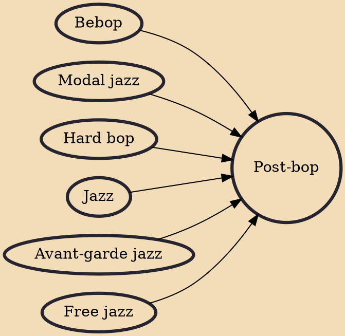

Post-bop is a genre of small-combo jazz that evolved in the early to mid 1960s in the United States. Pioneers of the genre, such as Miles Davis, Wayne Shorter, Herbie Hancock, John Coltrane and Jackie McLean, crafted syntheses of hard bop with contemporaneous developments in avant-garde jazz, modal jazz and free jazz that resulted in music with a complex and experimental flavor though still rooted in bop tradition, featuring less of the blues and soul leanings predominant in hard bop. The movement had a significant impact on subsequent generations of both acoustic jazz and fusion musicians.

## Influences
- [[Bebop]]
- [[Modal jazz]]
- [[Hard bop]]
- [[Jazz]]
- [[Avant-garde jazz]]
- [[Free jazz]]
