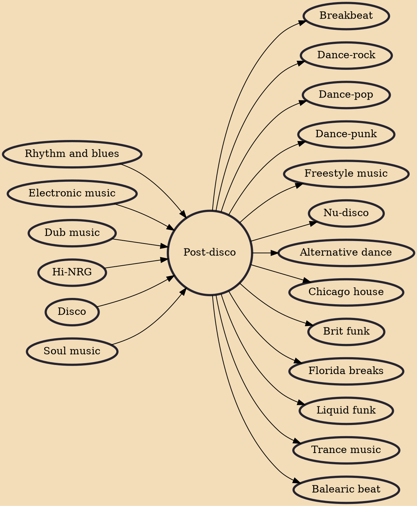

Post-disco (also called boogie, synth-funk, or electro-funk) is a term to describe an aftermath in popular music history circa 1979–1985, imprecisely beginning with an unprecedented backlash against disco music in the United States, leading to civil unrest and a riot in Chicago known as the Disco Demolition Night on July 12, 1979, and indistinctly ending with the mainstream appearance of new wave in 1980. During its dying stage, disco displayed an increasingly electronic character that soon served as a stepping stone to new wave, old-school hip hop, euro disco, and was succeeded by an underground club music called hi-NRG, which was its direct continuation.

## Influences
- [[Rhythm and blues]]
- [[Electronic music]]
- [[Dub music]]
- [[Hi-NRG]]
- [[Disco]]
- [[Soul music]]

## Derivatives
- [[Breakbeat]]
- [[Dance-rock]]
- [[Dance-pop]]
- [[Dance-punk]]
- [[Freestyle music]]
- [[Nu-disco]]
- [[Alternative dance]]
- [[Chicago house]]
- [[Brit funk]]
- [[Florida breaks]]
- [[Liquid funk]]
- [[Trance music]]
- [[Balearic beat]]
