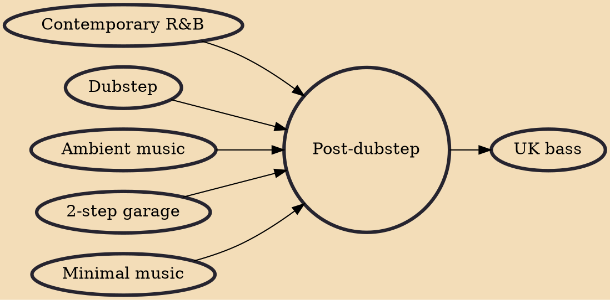

Post-dubstep is an umbrella term applied to a range of musical styles that have been influenced by the sparse, syncopated rhythms and heavy sub-bass of the UK dubstep scene. The breadth of styles associated with the term post-dubstep precluded it from being a specific musical genre in the early 2010s. Such music often references earlier dubstep productions as well as UK garage, 2-step and other forms of underground electronic dance music. Artists producing music that has been described as post-dubstep have also incorporated elements of ambient music and early 2000s R&B. The latter in particular is heavily sampled by two artists described as post-dubstep, Mount Kimbie and James Blake. The tempo of music typically characterised as post-dubstep is approximately 130 beats per minute.

## Influences
- [[Contemporary R&B]]
- [[Dubstep]]
- [[Ambient music]]
- [[2-step garage]]
- [[Minimal music]]

## Derivatives
- [[UK bass]]
