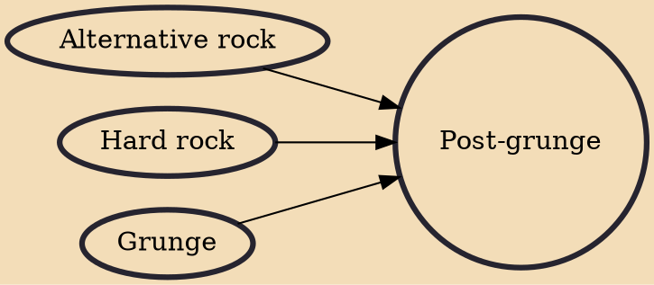

Post-grunge is a derivative of grunge that has a less abrasive or intense tone than traditional grunge. Originally, the term was used almost pejoratively to label mid-1990s rock bands such as Bush, Candlebox and Collective Soul that emulated the original sound of grunge.

## Influences

- [[Alternative rock]]
- [[Hard rock]]
- [[Grunge]]
