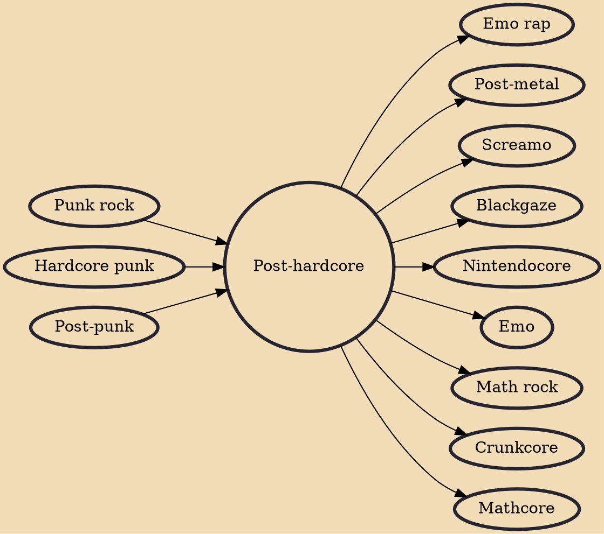

Post-hardcore is a punk rock music genre that maintains the aggression and intensity of hardcore punk but emphasizes a greater degree of creative expression. It was initially inspired by post-punk and noise rock. Like post-punk, the term has been applied to a broad constellation of groups. Post-hardcore began in the 1980s with bands like Hüsker Dü and Minutemen. The genre expanded in the 1980s and 1990s with releases by bands from cities that had established hardcore scenes, such as Fugazi from Washington, D.C. as well as groups such as Big Black and Jawbox that stuck closer to post-hardcore's noise rock roots. In the early- and mid-2000s, post-hardcore achieved mainstream success with the popularity of bands like My Chemical Romance, Dance Gavin Dance, AFI, Underoath, Hawthorne Heights, S

## Influences

- [[Punk rock]]
- [[Hardcore punk]]
- [[Post-punk]]

## Derivatives

- [[Emo rap]]
- [[Post-metal]]
- [[Screamo]]
- [[Blackgaze]]
- [[Nintendocore]]
- [[Emo]]
- [[Math rock]]
- [[Crunkcore]]
- [[Mathcore]]
