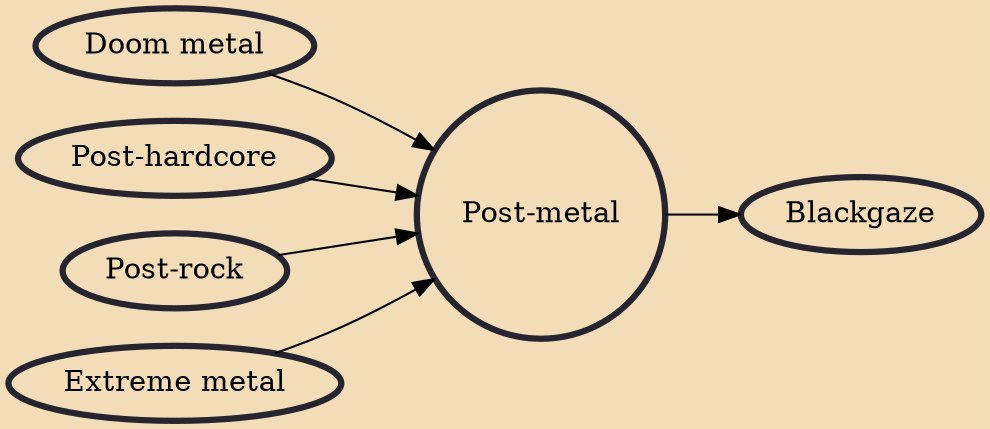

Post-metal is a music genre rooted in heavy metal but exploring approaches beyond metal conventions. It emerged in the 1990s with bands such as Neurosis and Godflesh, who transformed metal texture through experimental composition. In a way similar to the predecessor genres post-rock and post-hardcore, post-metal offsets the darkness and intensity of extreme metal with an emphasis on atmosphere, emotion, and even "revelation", developing an expansive but introspective sound variously imbued with elements of ambient, noise, psychedelic, progressive, and classical music. Songs are typically long, with loose and layered structures that discard the verse–chorus form in favor of crescendos and repeating themes. The sound centres on guitars (subjected to various effects) and drums, while any voca

## Influences
- [[Doom metal]]
- [[Post-hardcore]]
- [[Post-rock]]
- [[Extreme metal]]

## Derivatives
- [[Blackgaze]]
